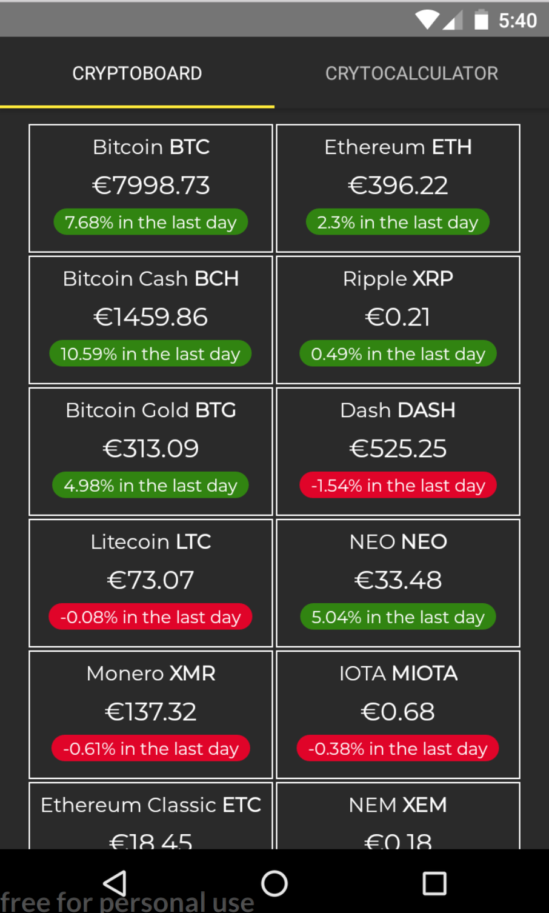
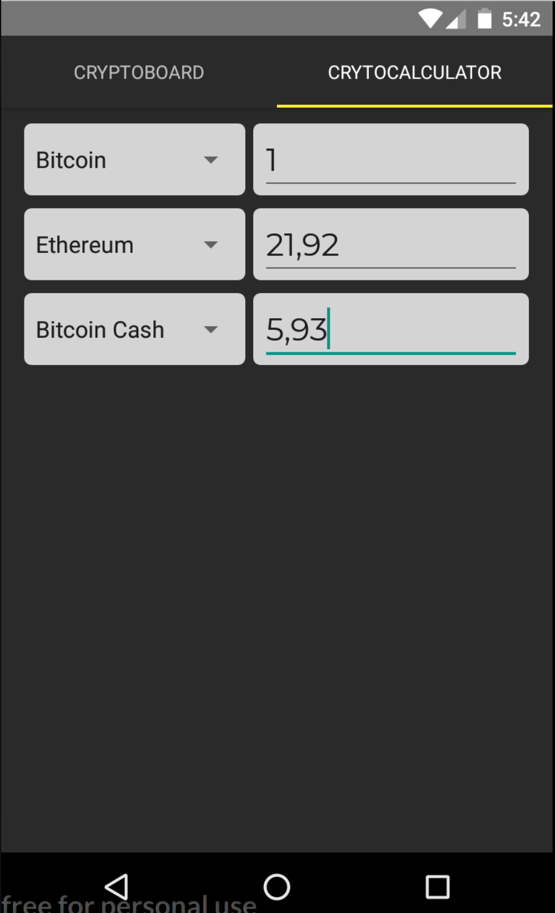

# Cryptocurrency Dashboard & Calculator

CryptoBoard                |  CryptoCalculator
:-------------------------:|:-------------------------:
  |  

This App uses:
  - React
  - React Native
  - React Redux
  - Redux Thunk
  - Flexbox

# Quick-Start Guide

- [Installation](#installation)
- [Development Workflow](#development-workflow)

## Installation

**1. Clone this repo:**

```bash
$ git clone git@github.com:lysandroc/frontend-challenge.git
$ cd frontend-challenge
```


**2. Install the dependencies:**

```bash
$ npm install
```

> is really just it


## Development Workflow


**3. Start a live-reload development server (android or ios):**
```bash
$ npm run android
$ npm run ios
```

> This command listen your code and every changes will update the app. (Livereload)

## License

MIT
